# Introduction
```
This project involves developing and deploying a static website for TechOps Solutions with a homepage, About Us, and Contact Us pages. It includes setting up version control using Git, building the site in a Linux environment, and deploying it on an AWS EC2 instance, gaining hands-on skills in Git, Linux development, and cloud deployment.
```

## MarketPeak Directory
```
At the start of the project, I created a dedicated directory for the MarketPeak project and named it MarketPeak-Ecommerce. I navigated into this directory using the cd command to set it as my working directory. Once inside, I initialized a Git repository for version control by running the git init command, allowing me to track all subsequent changes made to the project files. Additionally, I created a subfolder named img within the project directory, which I used to store all screenshots and visual assets required for project documentation and reference purposes.
```
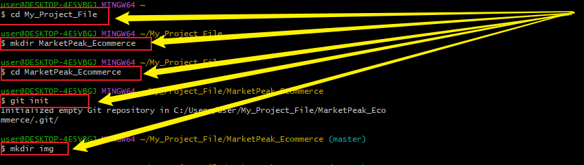


## Preparing the E-commerce Website Template
```
To streamline the development process and save time on initial design work, I downloaded a pre-built e-commerce website template to use as the foundation for this project. After the download was complete, I moved the template file from the Downloads folder into my designated project directory using the following command: "mv ~/Downloads/marketpeak-ecommerce-template.zip ~/My_Project_File/MarketPeak_Ecommerce" This command ensures that the template is organized within the correct project folder, keeping the workspace tidy and structured. Once the move was complete, I verified the transfer by running the ls -l command, which displayed the directory contents and confirmed that the template file had been successfully relocated to the project directory.
```
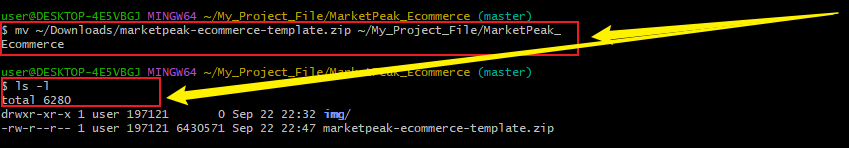

## Unzip the template
```
I downloaded and moved the e-commerce template into my project folder, unzipped it using unzip, and confirmed with ls -l that all files were extracted and ready for development.
```
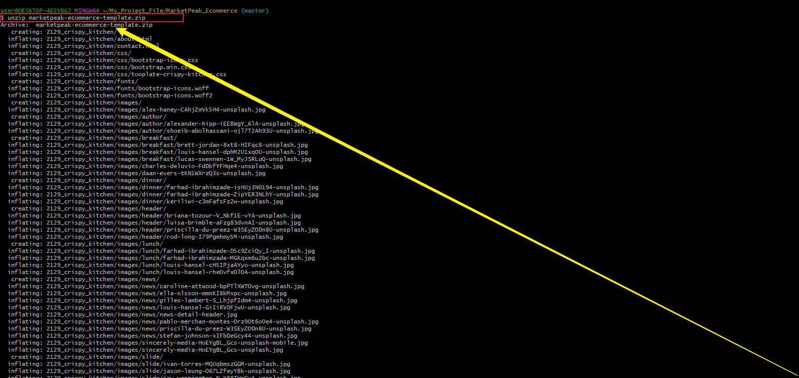

## Moving the Extracted Files into the Project Root
```
After extracting the template, I organized the project by moving all files from the marketpeak-ecommerce-template folder into the root directory. This was done using the mv marketpeak-ecommerce-template/* marketpeak-ecommerce-template/.* . 2>/dev/null command, which ensures both visible and hidden files are transferred while suppressing unnecessary error messages.

Once the files were moved, I removed the now-empty marketpeak-ecommerce-template folder with rm -rf marketpeak-ecommerce-template to keep the workspace tidy. To confirm everything was properly organized, I ran the ls -l command, which showed that all project files were correctly placed in the root directory for a cleaner and more professional structure.
```
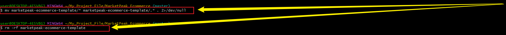

## Template Modification
```
I opened the project in Visual Studio Code using the code . command and modified the template by updating the title to MarketPeak. After making the change, I ran the git status command to check and track the updated file, ensuring the modification was recognized in version control.
```
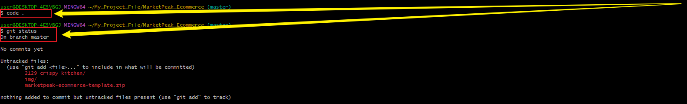

## Staging the Template
```
To prepare the modified files for commit, I first staged all changes using the git add . command, which includes every updated or new file in the project. After staging, I configured Git with my global username and email to ensure commits are properly linked to my identity across repositories. This was done using the commands git config --global user.name "YourUsername" and git config --global user.email "youremail@example.com". With these steps, the repository was both staged and correctly configured for version control.
```


## Commit Template
```
I finalized the staging process by committing the changes to the repository. This was done using the command git commit -m "Initial commit with basic e-commerce site structure", which records the staged files along with a clear and descriptive message. This commit marks the initial version of the project, saving the e-commerce template setup in Git and preparing it to be pushed to a remote repository.
```
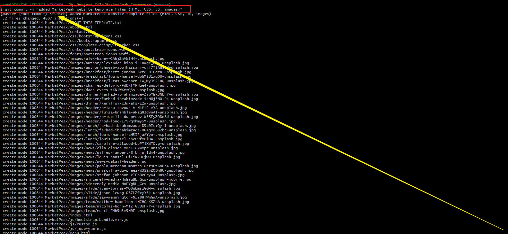

## Push the Code to GitHub Repository
```
To upload the local project to GitHub, I first linked the repository to the remote using the command git remote add origin https://github.com/ICO-Tech/MarketPeak_Ecommerce.git, establishing a connection between my local files and the GitHub repository. Once the remote was set, I pushed the committed changes using git push -u origin master, which successfully uploaded the project to GitHub and set the upstream branch for future pushes.
```
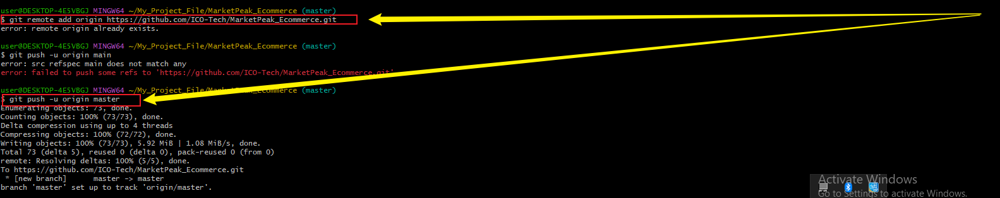

## Setting Up AWS EC2 Instance
```
I launched an Amazon EC2 instance using an Amazon Linux AMI to host the project. First, I logged into the AWS Management Console, navigated to EC2, and clicked Launch Instance, naming it MarketPeak-server for easy identification. I selected the Amazon Linux AMI (e.g., Amazon Linux 2023) and chose the t2.micro instance type to remain within the free-tier eligibility. For secure SSH access, I configured a key pair, downloading the .pem file if it was newly created. In the network settings, I assigned or created a security group and ensured that essential ports—including SSH (22), HTTP (80), and HTTPS (443)—were open to allow proper access to the server.
```
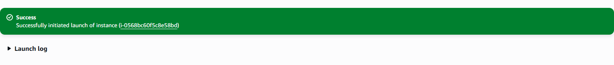

## Connecting to the EC2 Instance via SSH
```
After launching the EC2 instance and ensuring it was running, I connected to it securely via SSH using the command ssh -i "MarketPeak-key.pem" ec2-user@13.51.150.30. This allowed me to access the server directly with the ec2-user account using the key pair for authentication, enabling management and deployment of the project on the instance.
```
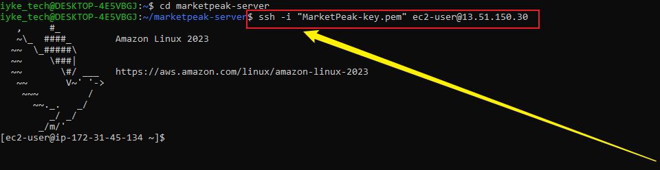

## Generating the SSH Key Pair
```
I first generated an SSH key pair on the EC2 instance using the ssh-keygen command, which creates a public and private key for secure authentication. After the key pair was generated, I displayed the public key using cat /home/ec2-user/.ssh/id_rsa.pub and copied it to link with my GitHub account. This setup allows the EC2 instance to authenticate with GitHub securely, enabling seamless cloning, pulling, and pushing of repositories without entering a password.
```
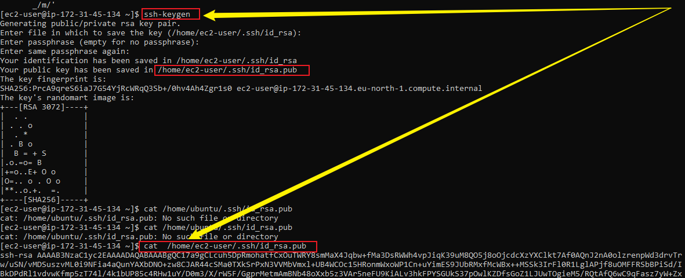


## Cloning the Repository on the Linux Server
```
On the EC2 instance, I cloned the GitHub repository to the server using git clone git@github.com:ICO-Tech/MarketPeak_Ecommerce.git. This securely copies the entire project via SSH, allowing me to access and work with the project files directly on the Linux server for deployment and further development.
```
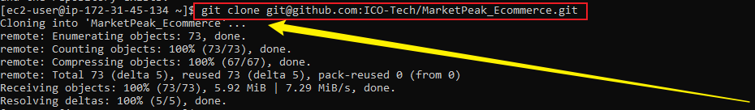

## Installing a Web Server on the EC2 Instance
```
I first updated the EC2 instance packages using sudo yum update -y to ensure the system was up to date. Then, I installed the Apache web server with sudo yum install httpd -y. To make the web server active and persistent across reboots, I started it using sudo systemctl start httpd and enabled automatic startup on boot with sudo systemctl enable httpd. This setup ensures the EC2 instance is ready to serve web content reliably.
```
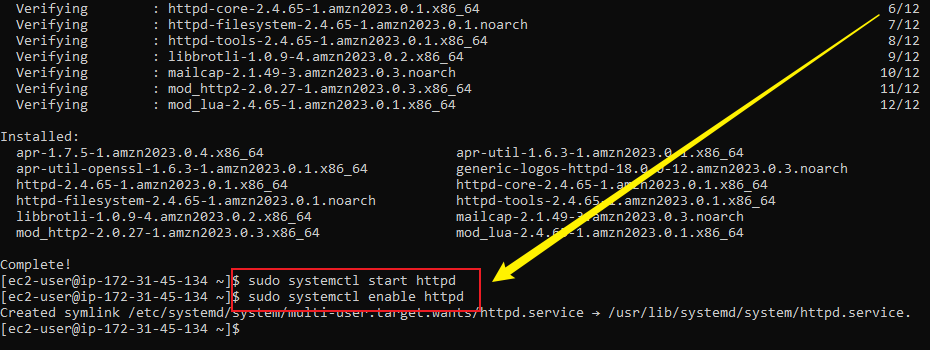


## Configuring Apache for the Website
```
I first removed the default Apache web directory using sudo rm -rf /var/www/html/ to clear the default content. Then, I replaced it with the project files by copying the entire MarketPeak_Ecommerce directory to the web root using sudo cp -r ~/MarketPeak_Ecommerce/* /var/www/html/. Finally, I reloaded the Apache server with sudo systemctl reload httpd to apply the changes, ensuring the EC2 instance serves the MarketPeak website correctly.
```
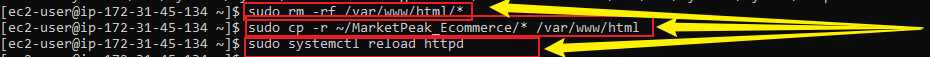

## Accessing the Website from a Browser
```
Once Apache was configured and the project files were in place, I accessed the MarketPeak website by entering the EC2 instance’s public IP address followed by the project folder name (http://public-IP/folder-name) in a web browser. This allowed the website to go live, confirming that the server was serving the content correctly and the deployment was successful.
```
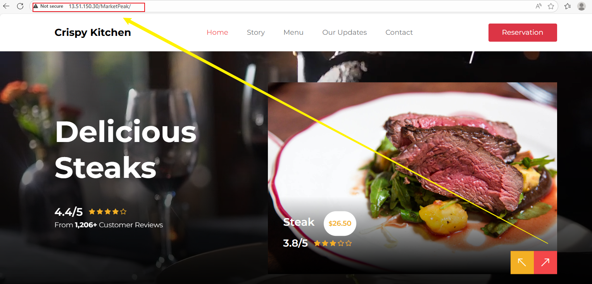

# CI/CD Workflow
```
To maintain an efficient development process for the e-commerce platform, I implemented a CI/CD workflow that integrates development, testing, and deployment. Changes were first made in the local development environment, tracked and managed using Git for version control, and then deployed to the AWS EC2 server. This workflow ensures that updates are systematically tested and deployed, enabling continuous integration and delivery while keeping the platform stable and up to date.
```
## Creating a New Branch "development"
```
I created a new Git branch named development to isolate feature changes from the main branch. After creating the branch, I switched to it and modified the webpage title, allowing me to make updates in a controlled environment without affecting the stable version of the project.
```
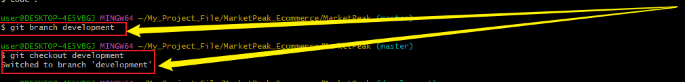

## Version Control with Git
```
I managed the project changes using Git for version control. First, I staged all modifications with the git add . command, then committed them using git commit -m "message" to securely record the changes. Finally, I pushed the development branch to GitHub using git push, ensuring that the updates were safely uploaded to the remote repository for tracking and collaboration.
```
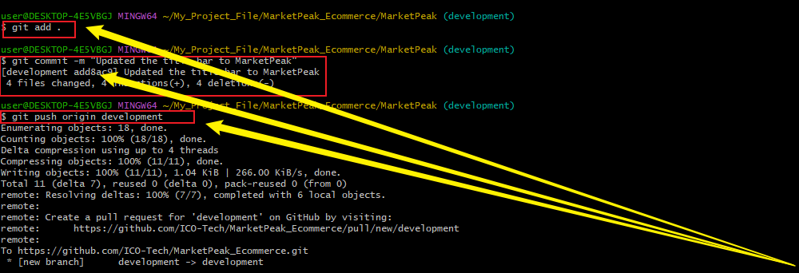

## Version Control with Git
```
After successfully pushing the development branch to GitHub, I switched back to the master branch to integrate the latest changes. I merged the development branch into master, combining all updates made during development. Finally, I pushed the updated master branch to the remote repository on GitHub, ensuring that the main branch reflected the most recent modifications and was synchronized with the online repository.
```
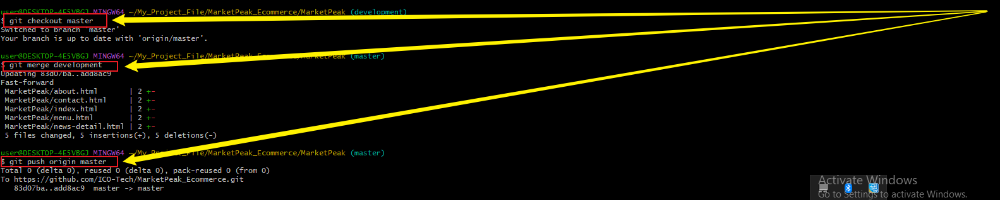

## Deploying Updates to the Production Server
```
To deploy the latest changes to the live environment, I first pulled the most recent updates from the GitHub repository onto the EC2 production server. After ensuring all changes were successfully retrieved, I reloaded the Apache web server to apply the updates, making the new features and modifications immediately available on the live website.
```
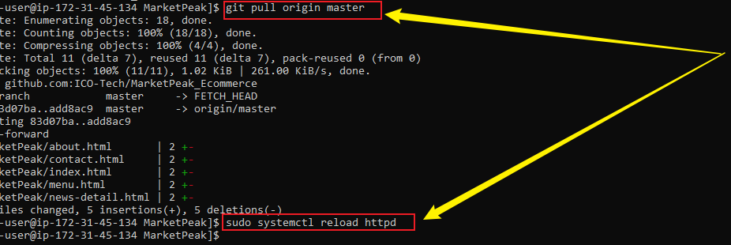

## Challenges
```
One challenge I encountered was when trying to push my local code to the remote repository using the command git push -u origin main. The push failed and returned an error because the default branch on my GitHub repository was named master rather than main. After identifying the mismatch, I modified the command to git push -u origin master, which successfully uploaded the code to the remote repository. This experience highlighted the importance of ensuring branch names are consistent between local and remote repositories.
```
